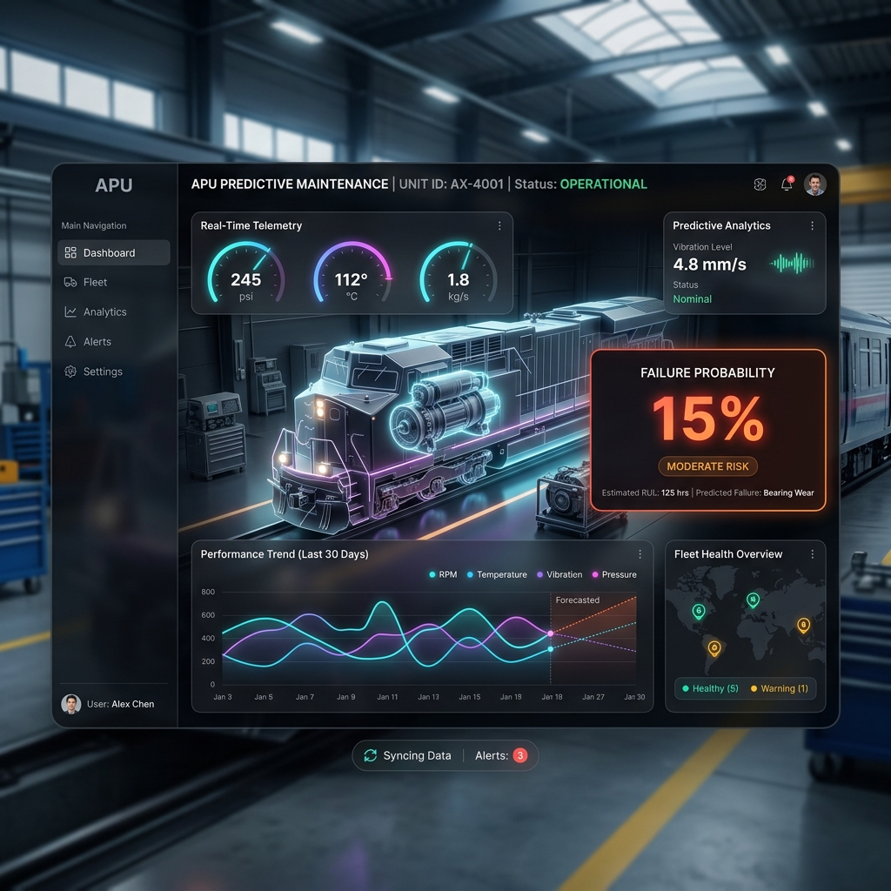
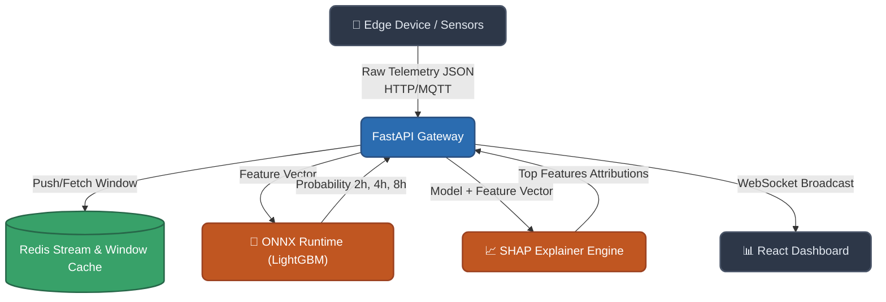
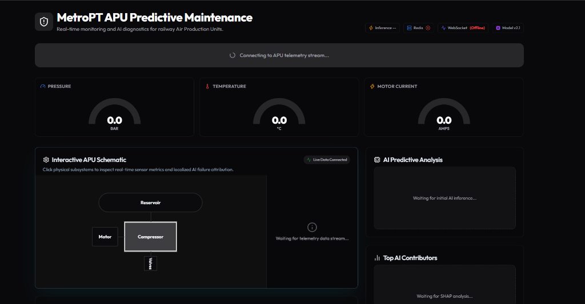

<div align="center">
  
  
  # 🚄 MetroPT APU Predictive Maintenance System

  **Real-Time Anomaly Detection & Remaining Useful Life (RUL) Prediction for Train Auxiliary Power Units**

  [](https://fastapi.tiangolo.com/)
  [](https://reactjs.org/)
  [](https://lightgbm.readthedocs.io/)
  [](https://redis.io/)
</div>

<br/>

## 📖 Overview

The **MetroPT APU Predictive Maintenance System** is a state-of-the-art machine learning solution designed to process multi-variate telemetry streams from train compressor units. It proactively identifies anomalous operating conditions and predicts potential failure events across multiple time horizons (2h, 4h, 8h).

By leveraging a highly optimized **LightGBM ONNX** model backed by a **FastAPI** streaming inference engine and a **React + Vite** real-time dashboard, operators can monitor fleet health, receive explainable insights (via SHAP values), and take preemptive action before mechanical breakdowns disrupt service.

---

## 🏗 Architecture

Our system is structured around an event-driven architecture, enabling sub-millisecond inference and immediate alert propagation.



### 🔹 Core Components
1. **Edge Telemetry Ingestion**: High-throughput ingestion of 15-sensor vectors via HTTP POST.
2. **Stateful Feature Engine (Redis)**: Caches streaming data to dynamically compute rolling windows and statistical aggregations (e.g., standard deviation over 10-minute intervals).
3. **Inference Engine**: Executes an ONNX-compiled LightGBM ensemble for blisteringly fast predictions.
4. **SHAP Explainer**: Generates natural language narratives based on localized feature attributions to provide actionable, explainable AI insights.
5. **Real-time Broadcast**: Propagates state updates to connected UI clients via WebSockets and Redis Pub/Sub.

---

## 🚀 Quickstart

### Prerequisites
- Python 3.11+
- Node.js 18+
- Redis Server (local or remote)

### 1️⃣ Backend Setup
```bash
# Clone the repository
git clone https://github.com/your-org/metropt-predictive-maintenance.git
cd metropt-predictive-maintenance

# Create and activate virtual environment
python -m venv venv
source venv/bin/activate  # Or `venv\Scripts\activate` on Windows

# Install dependencies
pip install -r requirements.txt

# Start the API server
uvicorn src.api.main:app --reload --port 8000
```

### 2️⃣ Frontend Setup
```bash
cd frontend

# Install dependencies
npm install

# Start the Vite development server
npm run dev
```

### 3️⃣ Simulate Traffic
To feed realistic data into the running local server, open a new terminal and run:
```bash
python scripts/simulate_edge_traffic.py --speed 5.0
```

---

## 🚢 Deployment (Render)

This repository is pre-configured for instant deployment on **[Render](https://render.com/)** using Infrastructure-as-Code (Blueprints). 
1. Push this repository to your GitHub account.
2. Go to your Render Dashboard -> **New** -> **Blueprint**.
3. Connect your GitHub repository.
4. Render will read `render.yaml` and automatically provision both the **Web Service** (Docker) and the **Redis Database**, linking them securely via the `REDIS_URL` environment variable.

---

## 🧪 Testing

The codebase maintains rigorous test coverage using `pytest`.

```bash
# Run backend test suite
python -m pytest tests/ -v
```

*(Note: API integration tests require a local Redis instance).*

---

## 📊 Dataset Attribution

This model was trained on the **Metro.PT Dataset** (2022).
> *Veloso, B., et al. "Predictive Maintenance of Train APU Compressor using Machine Learning".*

---
---

## 🛠 Troubleshooting & Production Case Studies

### ⚠️ Incident: Dashboard Stuck on "Connecting to APU Telemetry Stream..." & WebSocket Offline

<div align="center">
  
</div>

#### **Symptom**
When opening the production dashboard on Vercel, the UI displayed **"WebSocket (Offline)"** and remained stuck on *"Connecting to APU telemetry stream..."*. No live charts or AI risk scores were rendering despite the backend `/health` endpoint returning `200 OK`.

#### **Root Cause Analysis**
1. **Missing WebSocket Protocol Library in Docker Build**:
   `requirements.txt` listed `uvicorn` but omitted `websockets`. In local environments, `websockets` was installed in the developer virtual environment. However, inside the production Docker container, Uvicorn started with `--ws none` (WebSocket protocol support disabled). Any `wss://` handshake request was treated as a plain HTTP request, causing Starlette to return `HTTP 404 Not Found`.
2. **Reverse Proxy Scheme & Header Truncation**:
   Railway's edge proxy forwards `X-Forwarded-Proto` and `X-Forwarded-For` headers. Without explicit proxy header middleware, Uvicorn compared incoming requests against internal container HTTP bindings (`http://0.0.0.0:8000`) rather than the external HTTPS/WSS scheme (`wss://web-production-c421a.up.railway.app`), leading to protocol rejection.
3. **Idle TCP Connection Drop**:
   Cloud proxies close idle WebSocket connections after 30 seconds of silence, causing the UI connection status to repeatedly cycle between online and offline.
4. **Uncaught Date-fns Hover Exception**:
   Hovering mouse cursors over `TelemetryChart.tsx` passed `NaN` or unparsed timestamp values into `date-fns.format()`, throwing an uncaught `RangeError` that triggered the Next.js React Error Boundary.

#### **Resolution**
- **Dependency Fix**: Added `websockets>=12.0` to `requirements.txt` to enable full ASGI WebSocket protocol handling in the production Docker image.
- **Proxy Configuration**: Added `ProxyHeadersMiddleware` to `main.py` and appended `--proxy-headers --forwarded-allow-ips="*"` to Uvicorn in the `Dockerfile`.
- **Heartbeat Mechanism**: Added a 15-second client-side heartbeat ping interval (`ws.send("ping")`) in `WebSocketProvider.tsx` to prevent idle proxy timeouts.
- **Safe Date Formatting**: Implemented a `safeFormatTime()` utility with `isValid()` validation in `TelemetryChart.tsx` to handle unparsed dates gracefully.

---

<p align="center">Built with 💻 and 🚂 for reliable public transport systems.</p>
